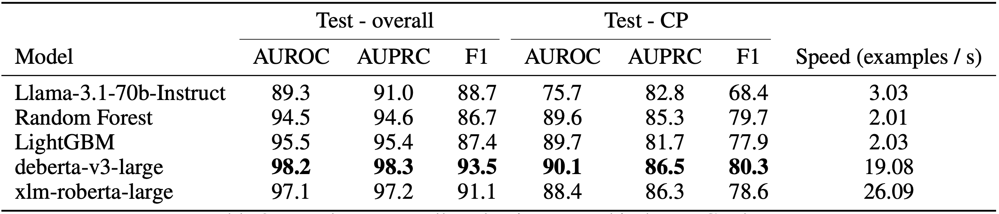

# RAGulator

This repository contains code to perform out-of-context detection with RAGulator, as described in [**RAGulator: Lightweight Out-of-Context Detectors for Grounded Text Generation**](https://aclanthology.org/2025.emnlp-industry.73/), which is published in EMNLP 2025 (Industry Track).

## Key Points
* RAGulator predicts whether a sentence is out-of-context (OOC) from retrieved text documents in a RAG setting.
* We preprocess a combination of summarisation and semantic textual similarity datasets (STS) to construct training data using minimal resources.
* We demonstrate two types of trained models: tree-based meta-models trained on features engineered on preprocessed text, and BERT-based classifiers fine-tuned directly on original text.
* The fine-tuned DeBERTa model stands out for its superior performance, speed, and simplicity, as it requires no additional preprocessing or feature engineering; it can be deployed as a service in real-time RAG workflows via a serving framework.

## Model Details

### Dataset
Training data for RAGulator is adapted from a combination of summarisation and STS datasets to simulate RAG:
* [BBC](https://www.kaggle.com/datasets/pariza/bbc-news-summary)
* [CNN DailyMail ver. 3.0.0](https://huggingface.co/datasets/abisee/cnn_dailymail)
* [PubMed](https://huggingface.co/datasets/ccdv/pubmed-summarization)
* [MRPC from the GLUE dataset](https://huggingface.co/datasets/nyu-mll/glue/)
* [SNLI ver. 1.0](https://huggingface.co/datasets/stanfordnlp/snli)

The datasets were transformed before concatenation into the final dataset. Each row of the final dataset consists \[`sentence`, `context`, `OOC label`\].
* For summarisation datasets, transformation was done by randomly pairing summary abstracts with unrelated articles to create OOC pairs, then sentencizing the abstracts to create one example for each abstract sentence.
* For STS datasets, transformation was done by inserting random sentences from the datasets to one of the sentences in the pair to simulate a long "context". The original labels were mapped to our OOC definition. If the original pair was indicated as dissimilar, we consider the pair as OOC.

To enable training of BERT-based classifiers, each training example was split into sub-sequences of maximum 512 tokens. The OOC label for each sub-sequence was derived through a generative labelling process with Llama-3.1-70b-Instruct.

### Model Training
RAGulator is fine-tuned from `microsoft/deberta-v3-large` ([He et al., 2023](https://arxiv.org/pdf/2111.09543.pdf)).

## Model Inference
To maximise model throughput, we identify each example with unique `pair_ids` during the chunking of examples into 512-token sub-sequences. The `pair_ids` are then used to aggregate the predictions at the example level. This is a simple yet effective way to speed up inference across multiple examples.

### Model Performance
<p align="center">
    
</p>

We compare our models against direct zero-shot prompting of Llama-3.1-70b-Instruct as a baseline, other black-box LLM-as-a-judge methods, and open-source grey-box detectors. We evaluate on both an in-distribution holdout split of our simulated RAG dataset, and an out-of-distribution collection of private enterprise data, which consists of human-annotated RAG responses from two industrial applications.

RAGulator-deberta-v3-large is our best-performing model variatnt, showing a 19% increase in AUROC and a 17% increase in F1 score from the baseline despite being significantly smaller than Llama-3.1. It also exhibits overall competitive performance against other black-box and grey-box detectors.

## Installation
The RAGulator model was trained using PyTorch 1.13.1. Although the model will run on PyTorch 2.x, we strongly recommend keeping to the same version used in training for result reproduction.
Run the following commands to install the package in a virtualenv:
```bash
python -m venv "ragulator-env"
source ragulator-env/bin/activate
pip install "ragulator @ git+https://github.com/ipoeyke/RAGulator.git@main"
```

## Usage - batch and long-context inference
We provide a simple wrapper to demonstrate batch inference and accommodation for long-context examples.
```python
from ragulator import RAGulator

model = RAGulator(
    model_name='deberta-v3-large', # only value supported for now
    batch_size=32, # inference batch size
    device='cpu' # corresponds to torch.device
)

# input
sentences = ["This is the first sentence", "This is the second sentence"]
contexts = ["This is the first context", "This is the second context"]

# batch inference
model.infer_batch(
    sentences,
    contexts,
    return_probas=True # True for OOC probabilities, False for binary labels
)
```

## Usage - OOC detection as a service (NEW!)
We demonstrate a basic Ray Serve application to show how RAGulator might be deployed as a service. To run the Ray Serve app, PyTorch 2.x is recommended as older versions may not be compatible.

After installation, run `./run_app.sh`. The app will be available at `http://127.0.0.1:8000`, and the Ray dashboard will be available at `http://127.0.0.1:8265`.

### API

The API provides three endpoints:

1. `GET /get_config` - View the default configuration of the model.
2. `POST /predict` - Predict for a single LLM response-context pair.
3. `POST /batch_predict` - Predict for a batch of LLM response-context pairs.

### Request Format

The request format for `POST /predict` is as follows:

```json
{
    "llm_response": "This is the only response.",
    "context": "This is the only context.",
    "context_window_length": 490,
    "minimum_sentence_length": 20,
    "threshold": 0.5,
    "return_probas": true
}
```

The request format for `POST /batch_predict` is as follows:

```json
{
    "llm_responses": ["This is the first response.", "This is the second response."],
    "contexts": ["This is the first context.", "This is the second context."],
    "context_window_length": 490,
    "minimum_sentence_length": 20,
    "threshold": 0.5,
    "return_probas": true
}
```

### Response Format

The response format for `POST /predict` is as follows:

```json
{
    "prediction": 1,
    "sentences_evaluated": ["This is the only sentence."]
}
```

The response format for `POST /batch_predict` is as follows:

```json
{
    "predictions": [1, 1],
    "sentences_evaluated": ["This is the first sentence.", "This is the second sentence."]
}
```

## Citation
```
@inproceedings{poey-etal-2025-ragulator,
    title = "{RAG}ulator: Lightweight Out-of-Context Detectors for Grounded Text Generation",
    author = "Poey, Ian  and
      Liu, Jiajun  and
      Zhong, Qishuai",
    editor = "Potdar, Saloni  and
      Rojas-Barahona, Lina  and
      Montella, Sebastien",
    booktitle = "Proceedings of the 2025 Conference on Empirical Methods in Natural Language Processing: Industry Track",
    month = nov,
    year = "2025",
    address = "Suzhou (China)",
    publisher = "Association for Computational Linguistics",
    url = "https://aclanthology.org/2025.emnlp-industry.73/",
    doi = "10.18653/v1/2025.emnlp-industry.73",
    pages = "1057--1071",
    ISBN = "979-8-89176-333-3",
    abstract = "Real-time identification of out-of-context outputs from large language models (LLMs) is crucial for enterprises to safely adopt retrieval augmented generation (RAG) systems. In this work, we develop lightweight models capable of detecting when LLM-generated text deviates from retrieved source documents semantically. We compare their performance against open-source alternatives on data from credit policy and sustainability reports used in the banking industry. The fine-tuned DeBERTa model stands out for its superior performance, speed, and simplicity, as it requires no additional preprocessing or feature engineering. While recent research often prioritises state-of-the-art accuracy through fine-tuned generative LLMs and complex training pipelines, we demonstrate how detection models are deployed efficiently with high speed and minimal resource usage."
}
```
